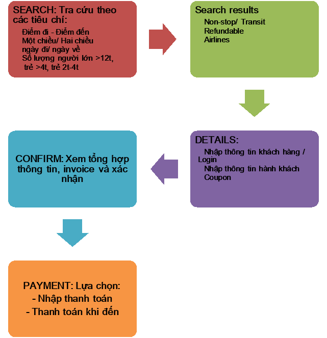
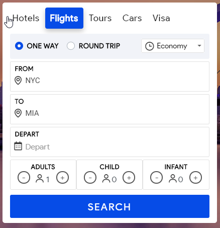
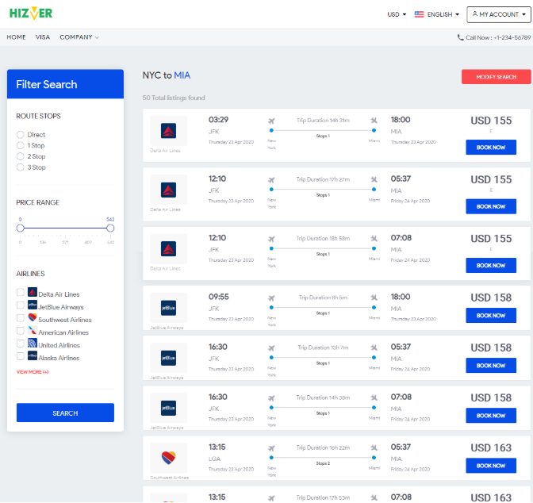
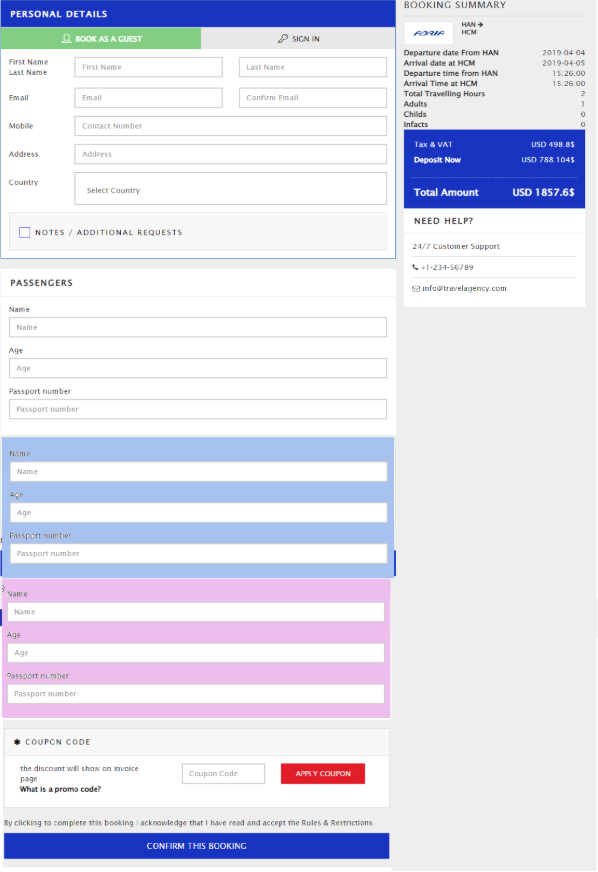
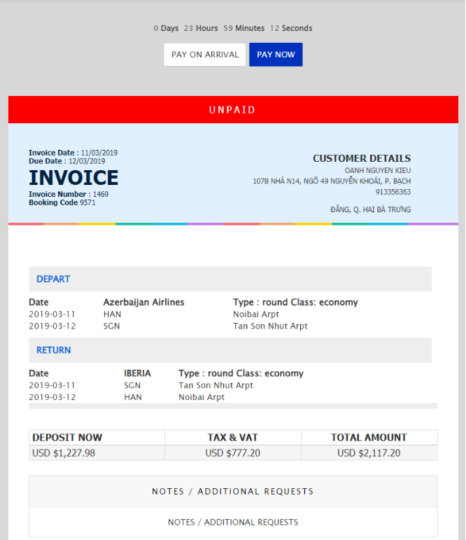


Fly booking requirements

History of documents

|**Version**|**Content**|**Author**|**Reviewed by**|
| :- | :- | :- | :- |
|**1.0**||||
|**1.1**||||
1. # **Work flow of Fly Booking**

**SEARCH: Tra cứu theo các tiêu chí:**

**Điểm đi - Điểm đến**

**Một chiều/ Hai chiều**

**ngày đi/ ngày về**

**Số lượng người lớn >12t,** 

` `**trẻ >4t, trẻ 2t-4t**

**Search results**

**Non-stop/ Transit**

**Refundable**

**Airlines**

**DETAILS:**

**Nhập thông tin khách hàng / Login** 

**Nhập thông tin hành khách**

**Coupon**

**CONFIRM: Xem tổng hợp thông tin, invoice và xác nhận**

**PAYMENT: Lựa chọn:**

**- Nhập thanh toán**

**- Thanh toán khi đến**

1. # **Mockup and Specification of Fly Booking**
   1. ## **SEARCH:** 
      1. ### **Link tham khảo : https://www.phptravels.net/**
      1. ### **Mockup:  Màn hình tra cứu chuyến bay**

|**#**|**Trường**|**Require**|**Mô tả**|
| :- | :- | :- | :- |
|**A**|**Các điều kiện tra cứu**|||
|**1**|Nơi đi|X|
- Nhận kí hiệu nơi đi, ví dụ HAN, hệ thống sẽ hiển thị nơi đi gồm Tên, mã. Ví dụ: Noi Bai airport (HAN)

- Chỉ hiển thị gợi ý (hint) khi gõ keyword từ 3 ký tự trở lên 
|
|**2**|Nơi đến|X|
- Nhận kí hiệu nơi đến, ví dụ SGN, hệ thống sẽ hiển thị nơi đến gồm Tên, mã. Ví dụ: Tan Son Nhat airport (HAN)

- Chỉ hiển thị gợi ý (hint) khi gõ keyword từ 3 ký tự trở lên

- Nơi đi và Nơi đến phải khác nhau 
|
|**3**|Ngày đi|x|Chỉ cho phép chọn ngày đi từ calendar|
|**4**|Ngày về||
Nếu người dùng chọn Một chiều (one way) thì chỉ chọn được ngày đi, ngày về bị ẩn

Nếu người dùng chọn Khứ hồi (Round trip) thì hiển thị ngày về và bắt buộc nhập bằng cách chọn ngày đi trên calendar
|
|**5**|Số lượng người lớn >12t|x|
Default=1

Phải nhập số lượng tối thiểu = 1, tối đa là 3

Cần cấu hình min = 1, max=3 để có thể thay đổi được
|
|**6**|Số lượng trẻ >=4t||Có thể không cần nhập, mặc định = 0|
|**7**|Số lượng trẻ < 4t||Có thể không cần nhập, mặc định = 0|
|**Lưu ý**|Tổng số ghế||
Tổng số ghế người lớn >= tổng số trẻ em

( Một người lớn chỉ được phép đi cùng với 1 trẻ em )
|
|**8**|Một chiều/ Khứ hồi|X|
Mặc định là option Một chiều (one way)

Nếu chọn Khứ hồi (Round trip) thì hiển thị thêm Ngày về
|
|**9**|Hạng |X|Mặc định là Economy. Được phép chọn khác ( Economy, Business, First )|
|**B**|**Button “Search”**||
Người dùng nhấn nút Search, hệ thống kiểm tra tính đúng đắn đầy đủ của dữ liệu:

- Báo lỗi “Xin hãy thông tin/ Please fulfill the input” nếu các trường bắt buộc bị thiếu thông tin (Nơi đi, nơi đến, ngày đi, số lượng người nếu =0)

- Nếu chọn Round trip, thì bắt buộc thêm trường ngày về

- Báo lỗi “Ngày về phải sau ngày đi” nếu trường ngày về <= ngày đi

Thông tin đầu vào đầy đủ, hợp lệ, hệ thống thực hiện tra cứu và hiển thị danh sách các chuyến bay của các hãng bay, giá vé cho các chuyến bay (Form FILTER)
|
1. ## **Search results :** 
   1. ### **Link tham khảo :**
   1. ### **Mockup:  Màn hình danh sách chuyến bay**

|**#**|**Trường**|**Require**|**Mô tả**|
| :- | :- | :- | :- |
||
**Các options ban đều load default là uncheck**

**Khi check 1 hoặc 1 vài điều kiện, thì tổ hợp theo điều kiện AND để hiển thị danh sách**
|||
|**A**|**Các điều kiện tra cứu**||
Hiển thị các dữ liệu mà ng dùng đã tra cứu

Người dùng có thể thay đổi điều kiện tra cứu để Search lượt mới
|
|**B**|**Nút “Search”**||
Nút search sẽ cập nhật kết quả seach cho phần 

**C. Date Availability** và **E. Available Flights**
|
|**C**|<h5>- **Filter by [ROUTE STOPS]**</h5>||NGười dùng có thể lọc tìm những chuyến bay thẳng hoặc những chuyến bay có trạm nghỉ|
|**D**|**Filter by [airlines]**||Hiển thị toàn bộ các hãng máy bay. Nếu người dùng chọn 1 hoặc 1 số các hãng bay, thì hệ thống tự động lọc các chuyến bay theo các hãng vừa chọn|
|**E**|**Available Flights**|||
|**1**|**Icon hãng bay, Tên hãng bay**||Hiển thị icon của hãng máy bay|
|**2**|**Mã số chuyến bay**||Mã số chuyến bay (ví dụ: 504)|
|**3**|**Thông tin đường bay**||Mã nơi đi, nơi đến. Ví dụ: HAN ⭢ SGN|
|**4**|**Thời gian khỏi hành**||Hiển thị Ngày, giờ bay|
|**5**|**Thời gian đến** ||Hiển thị ngày,giờ đến điểm đến|
|**6**|**Đặc điểm chuyến bay non-stop/transit**||Hiển thị Đặc điểm chuyến bay non-stop hoặc transit|
|**7**|**Hiển thị Giá vé**||Đơn vị tính USD|
|**8**|**Button [Book Now]**||Luôn luôn enable,click vào button này sẽ di chuyển đến màn hình nhập thông tin khách hàng|

1. ## **DETAILS: Nhập thông tin khách hàng  (Personal Details)**
- Tại màn hình Personal Details , user phải điền những thông tin cần thiết rồi click button [Confirm This Booking ] để đến màn hình lập hóa đơn “Invoice”.
- Max lenght cho các field = 50 characters . Nếu để trống trường bắt buộc thì hiển thị error message dưới textbox bị lỗi  : This field is required 

<table><tr><th colspan="1" valign="top"><b>#</b></th><th colspan="1" valign="top"><b>Trường</b></th><th colspan="1" valign="top"><b>Require</b></th><th colspan="1" valign="top"><b>Mô tả</b></th></tr>
<tr><td colspan="1" valign="top"></td><td colspan="1" valign="top"><b>Personal Details</b></td><td colspan="1" valign="top"></td><td colspan="1" valign="top"></td></tr>
<tr><td colspan="1" valign="top"><b>1</b></td><td colspan="1" valign="top">First Name</td><td colspan="1" valign="top">x</td><td colspan="1" rowspan="3" valign="top">là những trường bắt buộc phải nhập , nếu để trống sẽ hiển thị error message : This field is required , max = 50 lý tự</td></tr>
<tr><td colspan="1" valign="top"><b>2</b></td><td colspan="1" valign="top">Last Name</td><td colspan="1" valign="top">x</td></tr>
<tr><td colspan="1" valign="top"><b>3</b></td><td colspan="1" valign="top">Email</td><td colspan="1" valign="top">x</td></tr>
<tr><td colspan="1" valign="top"><b>4</b></td><td colspan="1" valign="top">Mobile </td><td colspan="1" valign="top"></td><td colspan="1" valign="top">Maxlength cho Mobile là 16 chỉ cho phép nhập vào là number </td></tr>
<tr><td colspan="1" valign="top"><b>5</b></td><td colspan="1" valign="top">Address</td><td colspan="1" valign="top"></td><td colspan="1" valign="top">Maxlength cho tất cả các trường còn lại trên form  này là 50 characters</td></tr>
<tr><td colspan="1" valign="top"><b>6</b></td><td colspan="1" valign="top">Country</td><td colspan="1" valign="top"></td><td colspan="1" valign="top">
Click vào field “Country” hiển thị danh sách các nước có trong hệ thống

User  có thể search country  ở item  Country
</td></tr>
<tr><td colspan="1" valign="top"><b>7</b></td><td colspan="1" valign="top">Coupon</td><td colspan="1" valign="top"></td><td colspan="1" valign="top">
User  có thể sử dụng mã giảm giá bắng cách nhập coupon Code hợp lệ vào trường [Conpon Code] rồi click [Apply Coupon] button  để hưởng những ưu đãi giảm giá

Nếu nhập mã giảm giá ,mà không click vào [Apply Coupon] thì mã coupon đó coi như không nhập
</td></tr>
<tr><td colspan="1" valign="top"></td><td colspan="1" valign="top"><b>Passengers</b></td><td colspan="1" valign="top"></td><td colspan="1" valign="top">
Nhập thông tin hành khách tham gia chuyến bay.

<b>Lưu ý</b>: các thông tin hành khách tương ứng với số lượng hành khách đã search.

Cần kiểm soát dữ liệu nhập ví dụ như: Khách hàng đặt 1 khách trên 12 tuổi, 1 khách từ 4-12 tuổi, và 1 khách dưới 4 tuổi, thì tương ứng giao diện phải hiển thị 3 khung nhập.

- Adult : form nền trắng

- Child : form nền xanh

- Infant: form nền hồng

Khi nhập xong hệ thống phải kiểm tra phải đủ 3 passenger và tuổi phải nằm trong khoảng đã nhập search ở trên.
</td></tr>
<tr><td colspan="1" valign="top"><b>8</b></td><td colspan="1" valign="top">Name</td><td colspan="1" valign="top">x</td><td colspan="1" valign="top">Nhập tên, chỉ gồm các kí tự Unicode</td></tr>
<tr><td colspan="1" valign="top"><b>9</b></td><td colspan="1" valign="top">Age</td><td colspan="1" valign="top">x</td><td colspan="1" valign="top">
Click vào hiển thị đúng số tuổi phải nằm trong khoảng đã đăng ký ở trên 

Vidu : nếu click vào Age ở form nền hồng thì chỉ hiển thị số tuổi từ : < 4 ,3,2,1,0
</td></tr>
<tr><td colspan="1" valign="top"><b>10</b></td><td colspan="1" valign="top">Passport Number</td><td colspan="1" valign="top">x</td><td colspan="1" valign="top">Nhập số, chữ, không gồm các kí tự đặc biệt, không gồm dấu cách</td></tr>
<tr><td colspan="1" valign="top"></td><td colspan="1" valign="top"><b>Coupon</b></td><td colspan="1" valign="top"></td><td colspan="1" valign="top"></td></tr>
<tr><td colspan="1" valign="top"><b>11</b></td><td colspan="1" valign="top">Coupon number</td><td colspan="1" valign="top"></td><td colspan="1" valign="top">Nhập số counpon, nhấn Apply, hệ thống sẽ kiểm tra valid của coupon ,nếu đúng thì sẽ giảm giá theo giá trị của coupon đó</td></tr>
<tr><td colspan="1" valign="top"></td><td colspan="1" valign="top"><b>Nhấn nút [Confirm This Booking ]</b></td><td colspan="1" valign="top"></td><td colspan="1" valign="top">Xác nhận thông tin đăng ký</td></tr>
<tr><td colspan="1" valign="top"></td><td colspan="1" valign="top"><b>Booking Summary</b></td><td colspan="1" valign="top"></td><td colspan="1" valign="top">Hiển thị thông tin chuyến bay</td></tr>
<tr><td colspan="1" valign="top"><b>12</b></td><td colspan="1" valign="top">Departure date From HAN2019-03-04</td><td colspan="1" valign="top"></td><td colspan="1" valign="top">
Hiển thị ngày khởi hành, cấu trúc:

Departure date From <nơi đi> <ngày đi>
</td></tr>
<tr><td colspan="1" valign="top"><b>13</b></td><td colspan="1" valign="top">Arrival date at SGN2019-03-05</td><td colspan="1" valign="top"></td><td colspan="1" valign="top">
Hiển thị ngày khởi hành, cấu trúc:

Arrival date at <nơi đến> <ngày đến>
</td></tr>
<tr><td colspan="1" valign="top"><b>14</b></td><td colspan="1" valign="top">Departure time from HAN20:58:00</td><td colspan="1" valign="top"></td><td colspan="1" valign="top">
Hiển thị thời gian khởi hành, cấu trúc:

Departure time From <nơi đi> <ngày đi>
</td></tr>
<tr><td colspan="1" valign="top"><b>15</b></td><td colspan="1" valign="top">Arrival Time at SGN20:58:00</td><td colspan="1" valign="top"></td><td colspan="1" valign="top">
Hiển thị thời gian khởi hành, cấu trúc:

Arrival time at <nơi đến> <ngày đến>
</td></tr>
<tr><td colspan="1" valign="top"><b>16</b></td><td colspan="1" valign="top">Total Travelling Hours7</td><td colspan="1" valign="top"></td><td colspan="1" valign="top">Hiển thị tổng thời gian di chuyển</td></tr>
<tr><td colspan="1" valign="top"><b>17</b></td><td colspan="1" valign="top">
Adults 1

Childs 0

Infacts 0
</td><td colspan="1" valign="top"></td><td colspan="1" valign="top">Hiển thị số lượng người đã đăng ký</td></tr>
<tr><td colspan="1" valign="top"><b>18</b></td><td colspan="1" valign="top">Deposit Now	USD 289.4688$</td><td colspan="1" valign="top"></td><td colspan="1" valign="top">Hiển thị giá vé</td></tr>
<tr><td colspan="1" valign="top"><b>19</b></td><td colspan="1" valign="top">Tax & VAT	USD 209.76$</td><td colspan="1" valign="top"></td><td colspan="1" valign="top">= 10% Hiển thị giá vé</td></tr>
<tr><td colspan="1" valign="top"><b>20</b></td><td colspan="1" valign="top">Total Amount	USD 971.52$</td><td colspan="1" valign="top"></td><td colspan="1" valign="top">Tổng tiền = Tax & VAT + Deposit Now</td></tr>
<tr><td colspan="1" valign="top"><b>21</b></td><td colspan="1" valign="top">
NEED HELP?

24/7 Customer Support

` `+92-3311442244

info@phptravels.com
</td><td colspan="1" valign="top"></td><td colspan="1" valign="top">
Thông tin hỗ trợ: Điện thoại, email

</td></tr>
</table>

**Note** : Có bao nhiêu người được select ở màn search fly  thì ở Form Passengers sẽ hiển thị tương ứng đúng số form = số người đã chọn ở màn search fly 

- Form Passengers màu trắng : nhập thông tin cho Adult ( field Age chỉ cho phép nhập số tuổi từ 12-> 100  )
- Form Passengers màu xanh : nhập thông tin cho Child  ( field child  chỉ cho phép nhập số tuổi từ 4->11 tuổi  )

- Form Passengers màu hồng : nhập thông tin cho Infant  ( field infant  chỉ cho phép nhập số tuổi từ 0->3 tuổi )

 

1. ## **CONFIRM: Xem tổng hợp, invoice và xác nhận đặt phòng** 
   1. ### **Booking Summary**
Hiển thị tổng hợp thông tin của phần booking

|#|Thông tin|Mô tả|
| :-: | :-: | :- |
||0 Days 23 Hours 52 Minutes 11 Seconds|
Thời gian số ngày, số giờ, số phút, số giây **còn lại phải thanh toán (đếm ngược)**

**Chú ý: hết thời gian cần thanh toán mà vẫn chưa có giao dịch thanh toán thành công trên hệ thống, hệ thống sẽ tự động hủy book vé này**
|
|12|UNPAID|Hiển thị trạng thái invoice là unpaid (chưa thanh toán)|
|23|Invoice Date |Hiển thị ngày tạo invoice, format ddd/mm/yyyy|
|3|Due Date |Hiển thị Due date là ngày hết hạn thanh toán của invoice = ngày invoice + 1 tháng|
|4|Invoice number|Hiển thị Số invoice|
|5|Customer Details|
Hiển thị thông tin khách hàng theo từng dòng:

1. Fullname

2. Email 

3. Address

4. Phone
|
|6|Depart|
Thông tin chuyến bay phần chiều đi:

Row 1: Date, Tên hãng máy bay, Loại (Oneway/Roundtrip), Hạng (economy/business/first)

Row 2: Hiển thị ngày giờ xuất phát từ Điểm đi, mã điểm đi (HAN), tên sân bay điểm đi (Noi Bai Airport)

Row 3: Hiển thị ngày giờ đến Điểm đến, mã điểm đến (SGN), tên sân bay điểm đến (Tan Son Nhat Airport)
|
|7|Return|Thông tin chuyến bay phần chiều về: Tương tự như phần chiều đi, với điều kiện lọc là thông tin của chiều về|
|8|
DEPOSIT NOW

TAX & VAT	

TOTAL AMOUNT
|
Hiển thị Số tiền trước thuế

Hiển thị Thuế, Vat (theo công thức)

Hiển thị Tổng số tiền
|
|9|NOTES / ADDITIONAL REQUESTS|Hiển thị phần ghi chú của khách hàng|
|10|Thông tin liên hệ hỗ trợ|
Tên công ty, địa chỉ, email, phone

PHPTRAVELS

` `1355 Market St, Suite 900 San Francisco, United States

` `info@phptravels.com

` `+92-3311442244
|
|11|Kết xuất thông tin|
Print : in thông tin booking từ trình duyệt

Download invoice : tải thông tin invoice về dạng file .png

Download PDF : Tải về dạng PDF

 Yêu cầu : Hiển thị phần in từ trình duyệt, file png và pdf phải đẩy đủ thông tin của invoice, không xô lệch.
|
||Thanh Toán |
Nút để lựa chọn thanh toán khi đến sân bay (Pay arrive), hoặc thanh toán ngay (Pay now)

|
||Pay on arrival|
Nếu User lick chọn [PAY ON ARIVAL] hệ thống sẽ tự động hiển thị confirmation pop-up với nội dung : Are you sure you want to pay at arrival ? và 2 button [Ok] , [Cancel]

- Nếu Click vào button [Ok] , hệ thống sẽ hiển thị message 

YOUR BOOKING STATUS IS RESERVED

YOU MUST CONFIRM YOUR BOOKING OTHERWISE IT WILL BE CANCELLED, PLEASE CONTACT US FOR FURTHER INFORMATION.

- Nếu click vào button [Cancel] >> pop-up được close đi . 

Tình trạng thanh toán của invoice cũng được cập nhật tương ứng
|
||Pay now|
- Sau khi chọn Payment Method >> Hiển thị màn hình nhập thông tin của khách hàng để thanh toán

Khi nhấn **pay now**: hiển thị thêm phần Phương thức thanh toán (Select payment method) : Gồm các payment method : **bank transfer, Credit Card, Visa,Paypal**

1. Nếu chọn **bank transfer** thì hiển thị thông tin tài khoản của công ty

2. Nếu chọn các loại thanh toán từ ngân hàng như **credit card,Visa** thì hiển thị thông tin thanh toán của khách hàng (Họ, Tên, Số thẻ, tháng năm hết hạn, số CVV). Valid nếu nhập thiếu thông tin, tháng năm hết hạn < tháng năm hiện tại, Số thẻ không đủ 16 chữ số, số CVV không đủ 3 chữ số.

3. Nếu chọn thanh toán ví điện tử là **Paypal** thì hiển thị nút “Pay” để redirect đến trang thanh toán của đối tác

4. Nếu thanh toán bị lỗi thì hiển thị thông báo lỗi

**Nhập đầy đủ thông tin hợp lệ , click [PAY NOW] >> Thanh toán thành công đồng thời hiển thị message : Invoice [invoice\_number] is paid successfully**  

**Sau khi thanh toán thành công thì cập nhật trạng thái UNPAID 🡪 PAID**
|

`		 `11** / 11**

