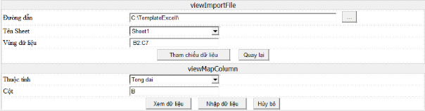

<Mã dự án>: Tài liệu đặc tả yêu cầu phần mềm				
|||
| :- | - |

**<TÊN DỰ ÁN>** 

***Tài liệu đặc tả yêu cầu phần mềm***

|**Mã dự án**|**<Mã dự án>**|
| :-: | :- |
|**Mã tài liệu**|**<Mã tài liệu>\_v<x/x/x>**|
|**Ngày**|**dd/mm/yyyy**|

**<Nơi, ngày làm tài liệu>**

**NỘI DUNG SỬA ĐỔI**

\*M- Mới S – Sửa X - Xóa

|**Ngày**|**Mục sửa đổi**|**M\* S, X**|**Nội dung sửa đổi**|**Người sửa đổi**|**Lần sửa đổi**|
| :-: | :-: | :-: | :-: | :-: | :-: |
|||||||
|||||||
|||||||
|||||||
|||||||
|||||||
|||||||
|||||||
|||||||
|||||||
|||||||
|||||||
|||||||
|||||||
|||||||

**TRANG KÝ**

**NGƯỜI LẬP:**		<Tên>		           	<Ngày>			

`	`<Vị trí>

**NGƯỜI KIỂM TRA:**	<Tên>		           	<Ngày>			

`	`<Vị trí>

**NGƯỜI PHÊ DUYỆT:**	<Tên>		           	<Ngày>			

`	`<Vị trí>

**MỤC LỤC**

[1.	GIỚI THIỆU	3](#_toc299715318)

[1.1.	Mục đích tài liệu	3](#_toc299715319)

[1.2.	Phạm vi hệ thống	3](#_toc299715320)

[1.3.	Định nghĩa thuật ngữ viết tắt	3](#_toc299715321)

[1.4.	Tài liệu tham khảo	3](#_toc299715322)

[1.5.	Mô tả tài liệu	3](#_toc299715323)

[2.	TỔNG QUAN HỆ THỐNG	3](#_toc299715324)

[2.1.	Phát biểu bài toán	3](#_toc299715325)

[2.2.	Mục tiêu hệ thống	3](#_toc299715326)

[2.3.	Người sử dụng hệ thống	3](#_toc299715327)

[3.	ĐẶC TẢ YÊU CẦU CHỨC NĂNG	3](#_toc299715328)

[3.1.	Phân hệ 1	3](#_toc299715329)

[4.	CÁC YÊU CẦU PHI CHỨC NĂNG	3](#_toc299715330)

[4.1.	Yêu cầu bảo mật (Mã hiệu yêu cầu người dùng)	3](#_toc299715331)

[4.2.	Yêu cầu sao lưu (Mã hiệu yêu cầu người dùng)	3](#_toc299715332)

[4.3.	Yêu cầu về tính sử dụng (Usability) (Mã hiệu yêu cầu người dùng)	3](#_toc299715333)

[4.4.	Yêu cầu về tính ổn định (Reliability) (Mã hiệu yêu cầu người dùng)	3](#_toc299715334)

[4.5.	Yêu cầu về hiệu năng (Performance) (Mã hiệu yêu cầu người dùng)	3](#_toc299715335)

[4.6.	Yêu cầu về tính hỗ trợ (Supportability) (Mã hiệu yêu cầu người dùng)	3](#_toc299715336)

[4.7.	Các ràng buộc thiết kế (Design Constraints) (Mã hiệu yêu cầu người dùng)	3](#_toc299715337)

[4.8.	Yêu cầu về Giao tiếp (Interfaces) (Mã hiệu yêu cầu người dùng)	3](#_toc299715338)

[4.9.	Các yêu cầu tài liệu người dùng và hỗ trợ trực tuyến (Mã hiệu yêu cầu người dùng)	3](#_toc299715339)

[4.10.	Các thành phần mua ngoài (Mã hiệu yêu cầu người dùng)	3](#_toc299715340)

[4.11.	Các yêu cầu pháp lý, bản quyền và những ghi chú khác  (Mã hiệu yêu cầu người dùng)	3](#_toc299715341)

[4.12.	Các tiêu chuẩn áp dụng (Mã hiệu yêu cầu người dùng)	3](#_toc299715342)

[4.13.	Các yêu cầu khác	3](#_toc299715343)

Ghi chú: 

- Các đoạn text nằm trong dấu ngoặc đơn vuông [] và được trình bày bằng màu chữ xanh Hyperlink là những mô tả chi tiết, hướng dẫn và có thể là những gợi ý cho các đề mục tương ứng.
- Các đoạn text nằm trong dấu ngoặc nhọn <> và được trình bày bằng màu chữ nâu là những ví dụ minh họa.

→ Các đoạn text này cần được bỏ khi người viết thực hiện viết các tài liệu trên template này.
1. # **GIỚI THIỆU**
   1. ## ***Mục đích tài liệu***
      [Chỉ ra mục tiêu mà tài liệu muốn hướng đến]

<***Ví dụ***: 

- Tài liệu này được xây dựng nhằm mục đích phân tích các yêu cầu cho dự án “Triển khai báo cáo điều hành” tại Công ty viễn thông liên tỉnh, đồng thời là cơ sở để đàm phán với khách hàng về phạm vi của dự án.
- Tài liệu này được dùng làm đầu vào cho các quá trình thiết kế, xây dựng usecase lập trình, system test của việc xây dựng hệ thống.

  >
  1. ## ***Phạm vi hệ thống***
     [Mô tả ngắn gọn các ứng dụng phần mềm được đặc tả trong tài liệu, các đặc trưng chức năng hay nhóm hệ thống con khác và những gì có liên quan hay có ảnh hưởng tới hệ thống.]

<***Ví dụ***: Tài liệu đặc tả các chức năng cần thiết của hệ thống báo cáo nhanh cho Công ty Viễn thông liên tỉnh. Hệ thống gồm 2 phân hệ: 

- Phân hệ Frontend 
- Phân hệ Backend.

  >

1. ## ***Định nghĩa thuật ngữ viết tắt***
   [Giải thích các thuật ngữ được sử dụng trong tài liệu]

|**STT**|**Nội dung**|**Ý nghĩa**|
| - | - | - |
|1|VTN|Công ty Viễn thông liên tỉnh|
|2|KH|Khách hàng|
||||
||||

1. ## ***Tài liệu tham khảo***
   [Đưa tên các tài liệu sử dụng để xây dựng tài liệu]

|**STT**|**Tên tài liệu**|
| - | - |
|1||
|2||

1. ## ***Mô tả tài liệu***
   [Nếu cấu trúc, nội dung của tài liệu]

<***Ví dụ***:

Nội dung tài liệu này bao gồm các phần:

1. Giới thiệu
1. Tổng quan hệ thống
1. Yêu cầu chức năng người sử dụng
1. Các yêu cầu khác
1. Tiêu chuẩn nghiệm thu hệ thống

   >
1. # **TỔNG QUAN HỆ THỐNG**
   1. ## ***Phát biểu bài toán***
[Phần này mô tả thật ngắn gọn các thông tin như: Thực trạng hiện tại bên khách hàng, nhu cầu xây dựng phần mềm, định nghĩa Hệ thống sẽ xây dựng, đáp ứng mong muốn gì của khách hàng, mang lại lợi ích ra sao, cho đối tượng nào?!?]

<***Ví dụ***:

Việc đầu tư, triển khai hệ thống báo cáo điều hành để phục vụ công tác điều hành sản xuất kinh doanh của Công ty Viễn thông liên tỉnh (VTN). Trong hoạt động sản xuất kinh doanh, các vị trí lãnh đạo của công ty phải thu thập một số lượng lớn báo cáo từ các đơn vị trực thuộc. Các báo cáo gửi về Công ty rất phong phú:

`	`- Báo cáo định kỳ: Hàng ngày, hàng tuần, hàng tháng, đột xuất…

`	`- Định dạng báo cáo: Word, Exel, pdf…

`	`- Cách thức báo cáo: Văn bản, Fax, Email, FTP, Web…	

Hệ thống báo cáo điều hành sẽ làm nâng cao năng lực giải quyết công việc, tăng hiệu quả sản xuất kinh doanh, tiết kiệm chi phí báo cáo. 

Do đó cần thiết phải xây dựng hệ thống báo cáo điều hành có khả năng:

- Hỗ trợ toàn bộ người sử dụng của công ty VTN xây dựng báo cáo trực tuyến mà không phải lập trình như Java, .NET và hỗ trợ mọi khuân dạng như PDF, DOC, POWERPOINT… và gửi các báo cáo này tới người dùng qua Web, email, máy in… 
- Không phải cài đặt các ứng dụng phức tạp để xây dựng các layout báo cáo. Đảm bảo hỗ trợ người dùng nghiệp vụ bình thường cũng có thể kết nối với Portal để xây dựng báo cáo, thông qua các ứng dụng văn phòng thông thường như Microsoft Word, Excel.  
- …

\>
1. ## ***Mục tiêu hệ thống***
[Nêu vắn tắt mục tiêu xây dựng hệ thống]

<***Ví dụ***:

Xây dựng “Hệ thống báo cáo điều hành” nhằm:

- Hỗ trợ công việc lập, gửi và phê duyệt báo cáo tại tất cả các câp
- Tích hợp phần mềm với Công thông tin điện tử hiện tại của Công ty.
- Tạo một cơ sở dữ liệu thống nhất về báo cáo trong Công ty.
- Các đơn vị có một công cụ báo cáo thuận tiện. Lãnh đạo và các Chuyên viên có công cụ theo dõi, tổng hợp báo cáo từ các đơn vị một cách nhanh chóng nhất.

  >
  1. ## ***Người sử dụng hệ thống***
<***Ví dụ***:

|**Người sử dụng**|**Mô tả**|
| - | - |
|Admin|Có quyền: tạo xóa, sửa, phân quyền user, role, backup dữ liệu, bảo mật hệ thống, cập nhật website. Xem nhật ký. mục trong một trang.|
|Báo cáo viên|Là nhân viên có trách nhiệm thực hiện báo cáo theo đúng quyền hạn của mình.|
|Chuyên viên|Là người dùng có trách nhiệm xem báo cáo, tạo báo cáo, thống kê báo cáo.|
|Lãnh đạo|Là người dùng có quyền xem và phê duyệt báo cáo.|

1. ## ***Mô hình phần rã chức năng của hệ thống***
   [Đưa ra mô hình phân rã các chức năng của hệ thống:

- Thể hiện được các phân hệ lớn
- Phân hệ con
- Các chức năng trong phân hệ
- …}

1. # **ĐẠC TẢ YÊU CẦU CHO TỪNG THÀNH PHẦN HỆ THỐNG**
[Các thông tin được yêu cầu ghi nhận trong Đề mục này gồm:

- Dựa trên system concept, mô hình triển khai của hệ thống xác định các thành phần cần có của hệ thống.
- Mô tả ngắn gọn các yêu cầu đối với từng thành phần của hệ thống: server DB, server webservice, client,…

Ví dụ:

Yêu cầu đối với server dữ liệu tại tổng công ty

Lưu trữ được toàn bộ dữ liệu của hệ thống sau khi các tỉnh truyền dữ liệu lên.

Đảm bảo thời gian trả lời cho các giao dịch không quá 5 giây

Yêu cầu đối với server DB local tại đầu tỉnh

Lưu trữ được toàn bộ dữ liệu khai thác trong 1 phiên khai thác hiện tại

Thời gian trả lời không quá 1s]
1. # **ĐẶC TẢ YÊU CẦU CHỨC NĂNG**
[Các thông tin được yêu cầu ghi nhận trong Đề mục này gồm:

- Mô tả ngắn gọn Chức năng hiện hành được sử dụng để làm gì
- Đưa ra các yêu cầu đối với từng chức năng:
  - Dữ liệu đầu vào
  - Yêu các các xử lý cần có cho chức năng
  - Các yêu cầu đặc biệt nếu có
  - Các yêu cầu phi chức năng đối với từng thành phần của phần mềm

**Việc mô tả các yêu cầu chức năng có thể thực hiện thông qua giao diện chức năng (nếu có) hoặc thông qua mô tả bằng thuật ngữ phần mềm.**

Đối với các báo cáo (Report) của hệ thống: **danh sách của chúng bắt buộc phải được liệt kê**, các Báo cáo nào cần thiết và quan trọng phải được mô tả chi tiết sao cho ***đội thiết kế của dự án có thể thiết kế đáp ứng được yêu cầu của báo cáo*** đó.

Độ sâu index của tài liệu có thể được đánh lại cho phù hợp với độ sau phân chia chức năng]

1. ## ***Phân hệ 1***
   1. ### ***<Mã hiệu yêu cầu: Chức năng 1> (Mã hiệu yêu cầu người dùng tương ứng)***
[Mã hiệu yêu cầu được đánh theo quy tắc: ‘SREQ’ + ‘00X’ (X: tăng dần trong toàn bộ tài liệu]

<***Ví dụ***:

**3.1.1 SREQ001 – Nhập báo cáo (UR002)**

1. **Mô tả nghiệp vụ**

   Chức năng nhập báo cáo cho phép người dùng nhập dữ liệu cho các báo cáo chưa có dữ liệu của hệ thống.

   Có hai phương thức nhập dữ liệu cho báo cáo:

- Nhập dữ liệu trên giao diện
- Nhập dữ liệu từ file excel.
1. **Yêu cầu chức năng**
- Hệ thống cho phép chọn loại đối tượng báo cáo cần nhập dữ liệu từ cây báo cáo sau đó chọn đối tượng báo cáo cần nhập.
- Hệ thống hiển thị danh sách các lần báo cáo trước đã nhập vào hệ thống.
- Để nhập dữ liệu trên giao diện, nhấn “Nhập mới dữ liệu” hệ thống tự động load các trường dữ liệu cần nhập cho báo cáo đó.
- Ví dụ trong hình: Hệ thống tự động load 2 trường: Tên lưu lượng, Số lưu lượng.

|**Tên trường**|**Mô tả**|
| :-: | :-: |
|Nút “Ghi”|Lưu thông tin vào CSDL|
|Nút “Hủy bỏ”|Hủy việc nhập thông tin|
|Nút “Quay lại”|Quay lại danh sách|

- Để nhập dữ liệu từ file excel, người dùng chọn đường dẫn đến file excel cần nhập.

|**Tên trường**|**Mô tả**|
| :-: | :-: |
|Đường dẫn|Đường dẫn đến file excel|
|Tên sheet|Chọn tên sheet cần lấy dữ liệu|
|Vùng dữ liệu|Chọn vùng dữ liệu cần lấy|
|Nút “Tham chiếu dữ liệu”|Nhấn nút “Tham chiếu dữ liệu” để ánh xạ các cột trong file excel với trường trong CSDL.|
|Nút “Quay lại”|Quay lại danh sách các đối tượng báo cáo đã nhập.|
|Thuộc tính|Thuộc tính của đối tượng|
|Cột|Cột trong file excel|
|Nút “Xem dữ liệu”|Cho phép xem lại dữ liệu vừa nhập|
|Nút “Nhập dữ liệu”|Nhập dữ liệu từ file excel vào|
|Nút “Hủy bỏ”|Hủy bỏ quá trình nhập file|

- Chọn sheet dữ liệu và chọn vùng dữ liệu cần lấy (Phần này cho phép chọn sheet dữ liệu và vùng dữ liệu mặc định theo lần đầu tiên nhập dữ liệu từ file excel).
- Để thay đổi các cột cần lấy dữ liệu trong file excel, nhấn “Tham chiếu dữ liệu”.
- Người dùng chọn các cột trong file excel tương ứng với trường dữ liệu cần lấy nếu muốn thay đổi. Mặc định hệ thống sẽ tự động ánh xạ các cột cần lấy với các trường dữ liệu như lần đầu tiên người dùng thực hiện import dữ liệu.
- Ví dụ: Chọn trường dữ liệu: “Tên lưu lượng” lấy dữ liệu từ cột A trong excel.
- Nhấp Nhập dữ liệu để thực hiện nhập thông tin.
  1. ### ***<Mã hiệu yêu cầu: Chức năng 2> (Mã hiệu yêu cầu người dùng)***
1. **Mô tả nghiệp vụ**
1. **Yêu cầu chức năng**

…..
1. ### ***<Mã hiệu yêu cầu: Chức năng n> (Mã hiệu yêu cầu người dùng)***
1. # **CÁC YÊU CẦU PHI CHỨC NĂNG**
[***Lưu ý***: Các yêu cầu Phi chức năng này nếu đã được đề cập đầy đủ trong URD thì không bắt buộc phải ghi nhận trong SRS; nếu có ghi nhận thì chỉ cần ghi nhận tham chiếu, hoặc nhấn mạnh (focus) vào các yêu cầu nào thực sự cần thiết đối với các yêu cầu chức năng phần mềm trong SRS là đủ. 

**Riêng trường hợp nếu tài liệu SRS là tài liệu cơ sở để nghiệm thu hệ thống (*mà không phải tài liệu URD*) thì bắt buộc phải ghi nhận các yêu cầu phi chức năng này**]
1. ## ***Yêu cầu bảo mật (Mã hiệu yêu cầu người dùng)***
   [Phần này mô tả tất cả các yêu cầu liên quan đến bảo mật dữ liệu. Các yêu cầu này có thể phát biểu độc lập ở đây hoặc trong phần phát biểu yêu cầu chức năng hoặc cả hai

   ***Các yêu cầu sẽ được liệt kê nếu có; ngược lại điền N/A hoặc không ghi nhận nếu không tồn tại yêu cầu loại này***]

- .......
  - .......
  1. ## ***Yêu cầu sao lưu (Mã hiệu yêu cầu người dùng)***
     [Phần này mô tả tất cả các yêu cầu liên quan đến sao lưu khôi phục dữ liệu. Các yêu cầu này có thể phát biểu độc lập ở đây hoặc trong phần phát biểu yêu cầu chức năng hoặc cả hai

     ***Các yêu cầu sẽ được liệt kê nếu có; ngược lại điền N/A hoặc không ghi nhận nếu không tồn tại yêu cầu loại này***]

     [***Ví dụ***: Hệ thống đáp ứng các yêu cầu:

Dữ liệu lưu trong hệ thống được sao lưu dự phòng tự động 24/24 bằng một hệ thống song hành tránh mất mát dữ liệu. Dữ liệu hệ thống có thể kết xuất ra các thiết bị lưu trữ ngoài và phục hồi khi cần thiết.]

- .......
  - .......
  1. ## ***Yêu cầu về tính sử dụng (Usability) (Mã hiệu yêu cầu người dùng)***
     [Phần này mô tả tất cả các yêu cầu liên quan đến tính sử dụng (usability). Chẳng hạn:

- Chỉ ra thời gian đào tạo cần thiết cho người dùng bình thường và người dùng chuyên trách để thao tác hiệu quả hệ thống
- Chỉ ra số lần tác vụ đo được (measurable task times) cho những tác vụ thông dụng hay thiết lập khả năng sử dụng (usability) của hệ thống mới trên nền các yêu cầu về tính sử dụng của hệ thống cũ hoặc hệ thống mà người dùng đã biết và cảm thấy phù hợp
- Chỉ ra yêu cầu phù hợp với những khả năng sử dụng chuẩn chung như chuẩn giao diện của Microsoft, …

***Các yêu cầu sẽ được liệt kê nếu có; ngược lại điền N/A hoặc không ghi nhận nếu không tồn tại yêu cầu loại này***]

[***Ví dụ***: Hệ thống đáp ứng các yêu cầu:

- Hệ thống cho phép truy cập dữ liệu thời gian thực. Các tác vụ thực hiện tức thời trong thời gian ngừng cho phép chấp nhận dưới 30s.
- Hệ thống đảm bảo phục vụ truy cập online 50 người cùng một lúc.
- Cung cấp một giao diện thân thiện phù hợp với quy trình nghiệp vụ hiện đang vận hành.
- Hệ thống đơn giản trong cài đặt và quản lý.
- Hệ thống hỗ trợ các trình duyệt phổ biến là IE, Nescape, Mozilla Firefox.]
- .......
  - .......
  1. ## ***Yêu cầu về tính ổn định (Reliability) (Mã hiệu yêu cầu người dùng)***
     [Các yêu cầu về tính ổn định của hệ thống mô tả ở đây. Một số đề xuất như:

- Tính sẵn sàng (Availability – Chỉ ra tỷ lệ phần trăm sẵn sàng ( xx.xx%), số giờ sử dụng, bảo hành, chế độ vận hành suy giảm ....
- Thời gian trung bình giữa hai sự cố (Mean Time Between Failures - MTBF) — được tính bằng giờ, tuy nhiên cũng có thể tính bằng ngày, tháng hoặc năm.
- Thời gian trung bình phải sửa chữa (Mean Time To Repair - MTTR)—Khi hệ thống bị lỗi, cho phép hệ thống không làm việc bao lâu?
- Tính chính xác – chỉ ra precision (resolution) và accuracy (theo tiêu chuẩn nào đó) đối với đầu ra của hệ thống.
- Maximum Bugs hay Defect Rate—thường biểu diến bằng (bugs/KLOC) hay bugs per function-point ( bugs/function-point).
- Bugs hay Defect Rate – phân loại theo minor, significant, hay critical bugs: Yêu cầu phải chỉ rõ thế nào là “critical” bug; ví dụ, mất dữ liệu toàn bộ hay mất khả năng sử dụng toàn bộ một phần chức năng nào đó của hệ thống.

***Các yêu cầu sẽ được liệt kê nếu có; ngược lại điền N/A hoặc không ghi nhận nếu không tồn tại yêu cầu loại này***]

[***Ví dụ***: Hệ thống đáp ứng các yêu cầu:

- Khi xảy ra các sự cố làm ngừng vận hành hệ thống, hệ thống phải đảm bảo phục hồi 90% trong vòng 1h và 100% trong vòng 24h.
- Hệ thống gây trung bình 1 lỗi / tháng trong 3 tháng vận hành đầu tiên. 1 lỗi / năm trong 3 năm vận hành tiếp theo và 0 lỗi / năm trong các năm vận hành tiếp theo. Lỗi chấp nhận là lỗi trung bình không gây tổn hại trầm trọng hệ thống và có thể phục hồi 90% hiệu quả.]
- .......
  - .......
  1. ## ***Yêu cầu về hiệu năng (Performance) (Mã hiệu yêu cầu người dùng)***
     [Yêu cầu về các đặc trưng hiệu năng của hệ thống được mô tả ở đây. Nó bao gồm thời gian phản hồi đặc trưng. Khi có thể, tham chiếu tới những Use Cases liên quan theo tên.

- Response time đối với giao dịch (average, maximum)
- Throughput, ví dụ, số giao dịch trong 1 giây
- Capacity, ví dụ, số khách hàng hay giao dịch mà hệ thống có thể đáp ứng 
- Degradation modes (Chế độ làm việc có thể chấp nhận được mỗi khi hệ thống bị trục trặc nào đó)
- Resource utilization, như memory, disk, communications,...

***Các yêu cầu sẽ được liệt kê nếu có; ngược lại điền N/A hoặc không ghi nhận nếu không tồn tại yêu cầu loại này***]

[***Ví dụ***: Hệ thống đáp ứng các yêu cầu:

- Các tác vụ thực hiện tức thời trong thời gian ngừng cho phép chấp nhận dưới 30s.
- Hệ thống đảm bảo phục vụ truy cập online 50 người cùng một lúc.]
- .......
  - .......
  1. ## ***Yêu cầu về tính hỗ trợ (Supportability) (Mã hiệu yêu cầu người dùng)***
     [Phần này chỉ ra những yêu cầu về khả năng hỗ trợ, bảo hành hệ thống được xây dựng, bao gồm coding standards, naming conventions, class libraries, maintenance access, và maintenance utilities.

     ***Các yêu cầu sẽ được liệt kê nếu có; ngược lại điền N/A hoặc không ghi nhận nếu không tồn tại yêu cầu loại này***]

     [***Ví dụ***: Hệ thống đáp ứng các yêu cầu:

- Hệ thống được hỗ trợ 24/24 trong vòng 1 năm miễn phí sau khi hệ thống vận hành chính thức. Các hỗ trợ được thực hiện, phản hồi trong vòng tối đa 48 tiếng giờ làm việc.]
- .......
  - .......
  1. ## ***Các ràng buộc thiết kế (Design Constraints) (Mã hiệu yêu cầu người dùng)***
     [Phần này chỉ ra những ràng buộc về thiết kế đối với hệ thống được xây dựng. Các ràng buộc thiết kế là những quyết định thiết kế (design decisions) mà ta phải tuân thủ. Ví dụ ngôn ngữ lập trình, software process requirements, công cụ phát triển sử dụng, các ràng buộc kiến trúc và thiết kế, các thành tố mua ngoài, class libraries, ....

     ***Các yêu cầu sẽ được liệt kê nếu có; ngược lại điền N/A hoặc không ghi nhận nếu không tồn tại yêu cầu loại này***]

     [***Ví dụ***: Hệ thống đáp ứng các yêu cầu:

- Hệ thống được xây dựng trên mã nguồn mở. 
- Sử dụng công nghệ servlet/jsp. 
- Web server được sử dụng là Tomcat Apache.
- Web browser là IE hoặc Netscape hoặc Mozilla Firefox
- Hệ quản trị cơ sở dữ liệu là MySQL
- Công cụ phát triển là JBuilder 7.0, EMS, Rational Rose, Photoshop 7.0, Dreamwaver, Microsoft Sourcesafe 6.0
- Phân tích và thiết kế được thực hiện theo chuẩn UML
- Các công cụ hỗ trợ không tính bản quyền, thư viện hỗ trợ khác phải là mã nguồn mở.
- Hệ thống được thiết kế theo hướng có khả năng phát triển trong tương lai với việc thêm bớt các module, hoặc tích hợp hệ thống vào một hệ thống khác dễ dàng.]
- .......
  - .......
  1. ## ***Yêu cầu về Giao tiếp (Interfaces) (Mã hiệu yêu cầu người dùng)***
     [Phần này xác định giao tiếp mà ứng dụng hỗ trợ. Nó bao gồm đặc trưng thích hợp, protocols, ports và logical addresses, v.v.., sao cho phần mềm có thể xây dựng và kiểm tra theo các yêu cầu giao tiếp đó

     ***Các yêu cầu sẽ được liệt kê nếu có; ngược lại điền N/A hoặc không ghi nhận nếu không tồn tại yêu cầu loại này***]

- .......
  - .......
    1. ### ***Giao tiếp người dùng (User interfaces) (Mã hiệu yêu cầu người dùng)***
[Phần này mô tả tất cả các yêu cầu liên quan đến giao diện của ứng dụng như font chữ, kích thước màn hình,…

Mô tả các giao diện được thực hiện cho phần mềm

***Các yêu cầu sẽ được liệt kê nếu có; ngược lại điền N/A hoặc không ghi nhận nếu không tồn tại yêu cầu loại này***]

[***Ví dụ***: Hệ thống đáp ứng các yêu cầu:

- Giao diện web
- Giao diện mang tính hiện đại, có tính thẩm mỹ
- Font chữ Unicode 6909
- Giao diện thiết kế trên màn hình độ phân giải tối thiểu 800x600, chế độ màu tối thiểu high color (16 bits)
- Ngôn ngữ sử dụng trong toàn bộ hệ thống là tiếng việt
- Định dạng ngày được sử dụng trong hệ thống là dd/mm/yyyy
- Định dạng số được sử dụng trong hệ thống là 000.000,000]
- .......
  - .......
    1. ### ***Giao tiếp Phần Cứng (Hardware interfaces) (Mã hiệu yêu cầu người dùng)***
[Phần này xác định giao tiếp phần cứng mà phần mềm hỗ trợ, bao gồm cấu trúc logic, physical addresses, expected behavior, ....

***Các yêu cầu sẽ được liệt kê nếu có; ngược lại điền N/A hoặc không ghi nhận nếu không tồn tại yêu cầu loại này***]
1. ### ***Giao tiếp phần mềm (Software interfaces) (Mã hiệu yêu cầu người dùng)***
   1. #### **Giao tiếp giữa các chức năng của hệ thống**
[Phần này mô tả giao tiếp của các module / các chức năng bên trong hệ thống với nhau]. 

[***Ví dụ***: 

Hệ thống sẽ đáp ứng các nhu cầu giao tiếp sau:

- Phân hệ quản trị sản phẩm, bản tin sẽ sử dụng thông tin từ phân hệ nhóm sản phẩm, bản tin để cập nhật.
- Phân hệ tra cứu sản phẩm sẽ truy xuất thông tin từ phân hệ quản trị sản phẩm.
- Các phân hệ sẽ được phân quyền dựa trên thông tin doanh nghiệp và phân hệ quản trị người dùng.
- Phân hệ báo cáo lấy số liệu từ các phân hệ khác]
- .......
  - .......
    1. #### **Giao tiếp bên ngoài với các Phần mềm khác**
[Phần này mô tả giao tiếp phần mềm với những thành phần khác của hệ thống. Chúng có thể là module mua ngoài, thành phần tái sử dụng từ ứng dụng khác hay thành phần được phát triển cho hệ thống con nằm ngoài phạm vi của tài liệu này những ứng dụng này lại có giao tiếp tới.

***Các yêu cầu sẽ được liệt kê nếu có; ngược lại điền N/A hoặc không ghi nhận nếu không tồn tại yêu cầu loại này***]

[Ví dụ: Hệ thống đáp ứng các yêu cầu:

- Hệ thống giao tiếp với hệ thống người dùng LDAP hiện tại sử dụng tại sở
- Hệ thống xử lý dữ liệu và export Báo cáo về Sở thông qua hệ thống web và mail theo đường ADSL, hoặc leased line]
- .......
  - .......
    1. ### ***Giao tiếp truyền thông (Mã hiệu yêu cầu người dùng)***
[Mô tả giao tiếp truyền thông với hệ thống khác hay thiết bị như mạng nội bộ, thiết bị truy cập từ xa ....

***Các yêu cầu sẽ được liệt kê nếu có; ngược lại điền N/A hoặc không ghi nhận nếu không tồn tại yêu cầu loại này***]

[***Ví dụ***: Hệ thống đáp ứng các yêu cầu:

- Hệ thống vận hành tại máy chủ sở KHCN và được truy cập trực tiếp từ internet]
- .......
  - .......
  1. ## ***Các yêu cầu tài liệu người dùng và hỗ trợ trực tuyến (Mã hiệu yêu cầu người dùng)***
     [Mô tả yêu cầu, nếu có, đối với tài liệu người dùng, hỗ trợ hệ thống trực tuyến ....

     ***Các yêu cầu sẽ được liệt kê nếu có; ngược lại điền N/A hoặc không ghi nhận nếu không tồn tại yêu cầu loại này***]

     [***Ví dụ***: Hệ thống đáp ứng các yêu cầu:

- Tài liệu người dùng được cung cấp đến tận tay người sử dụng cuối
- Tổ chức huấn luyện người dùng cuối sử dụng hệ thống
- Hỗ trợ hệ thống giúp đỡ trực tuyến cho người dùng cuối. Hệ thống giúp đỡ trực tuyến được tích hợp trực tiếp vào hệ thống]
- .......
  - .......
  1. ## ***Các thành phần mua ngoài (Mã hiệu yêu cầu người dùng)***
     [Phần này mô tả các thành phần mua ngoài mà hệ thống sử dụng, license áp dụng hay hạn chế sử dụng, và bất cứ tieu chuẩn nào về tính tương thích, giao tiếp

     ***Các yêu cầu sẽ được liệt kê nếu có; ngược lại điền N/A hoặc không ghi nhận nếu không tồn tại yêu cầu loại này***]

- .......
  - .......
  1. ## ***Các yêu cầu pháp lý, bản quyền và những ghi chú khác  (Mã hiệu yêu cầu người dùng)***
     [Xác định các yêu cầu về bản quyền hay những yêu cầu hạn chế đối với phần mềm, mô tả những từ bỏ pháp lý cần thiết, quyền bảo hành, bản quyền, phát minh, wordmark, trademark, hay những vấn đề về logo compliance đối với phần mềm

     ***Các yêu cầu sẽ được liệt kê nếu có; ngược lại điền N/A hoặc không ghi nhận nếu không tồn tại yêu cầu loại này***]

     [***Ví dụ***: Hệ thống đáp ứng các yêu cầu:

- Sau khi hệ thống vận hành, toàn bộ source code phát triển hệ thống được chuyển giao và thuộc quyền quản lý của sở KHCN]
- .......
  - .......
  1. ## ***Các tiêu chuẩn áp dụng (Mã hiệu yêu cầu người dùng)***
     [Phần này mô tả các tham chiếu tới những tiêu chuẩn áp dụng và những đoạn đặc thù của tiêu chuẩn nào đó mà hệ thống áp dụng. Ví dụ, nó có thể bao gồm các tiêu chuẩn về pháp lý, chất lượng, qui định, các chuẩn công nghiệp về tính khả dụng, interoperability, internationalization, operating system compliance, ....

     ***Các yêu cầu sẽ được liệt kê nếu có; ngược lại điền N/A hoặc không ghi nhận nếu không tồn tại yêu cầu loại này***]

     [***Ví dụ***: Hệ thống đáp ứng các yêu cầu:

- Quy trình phát triển và xây dựng hệ thống được quản lý theo chuẩn ISO....]
- .......
  - .......
  1. ## ***Các yêu cầu khác***
     **[*Các yêu cầu sẽ được liệt kê nếu có; ngược lại điền N/A hoặc không ghi nhận nếu không tồn tại yêu cầu loại này***]

- .......
  - .......

`	`Tài liệu nội bộ	17/18

